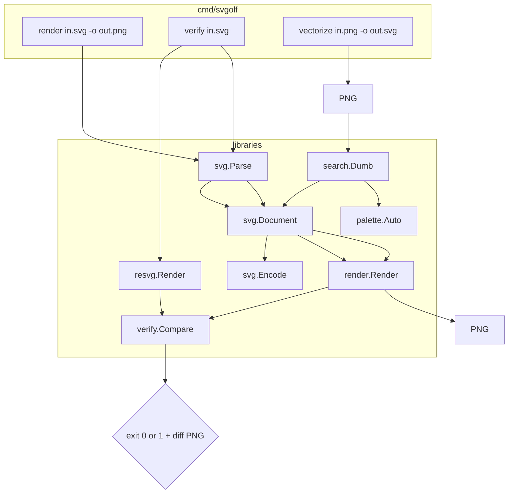
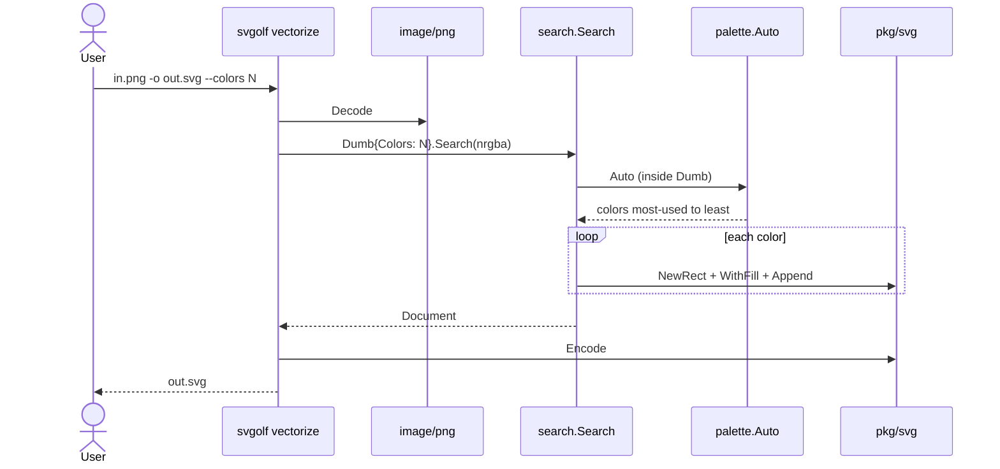
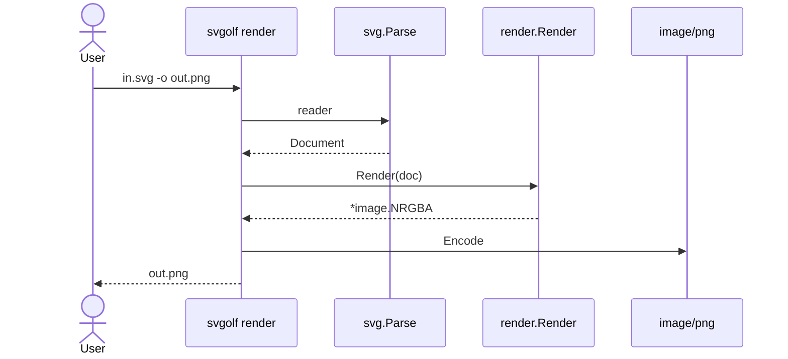

# svgolf v1 — technical spec

| Field | Value |
| --- | --- |
| Title | svgolf v1 — technical spec |
| Author | LEWTEC |
| Date | 2026-08-27 |
| Status | Draft |
| Module | `github.com/lewtec/svgolf` |
| Workspace | `/home/lucasew/WORKSPACE/LEWTEC/svgolf` (empty git root) |

This document is the implementation contract. It does not reopen locked product decisions.

---

## Overview

svgolf turns a PNG — especially a model-generated logo — into the simplest hand-editable SVG. Current tracers emit noisy paths. v1 ships a trusted render pipeline, an SVG-like tree, a Cobra CLI, Search (Dumb adapter), and exact-match fuzz against **resvg**.

v1 Search is Dumb: one shot, no Loss loop. Loss formula, ColorMap variants, primitive weight iteration, gradients, and union/boolean remain later adapter seams.

---

## Background and motivation

Logo SVGs must stay editable in Figma and Inkscape. A 400-node path that “looks close” fails that bar.

The repo is empty. Sibling modules (`backstage`, `ciborg`, `eletrocromo`, `galho`, `launcher`) are Cobra/mise Go tools. svgolf follows that layout and pins tools with mise. No host-global installs.

Pain:

- Tracers flatten marks to path soup.
- In-process crates (oksvg, usvg, canvas) replace the DOM with their own draw list.
- Approximate metrics hide one-pixel errors that later Loss will need.

v1 builds the pixmap contract first. Future search consumes that pixmap.

---

## Goals and non-goals

### Goals

- Production SVG: few native primitives, clean geometry.
- Tree of opaque structs with `New*` zeros equal to SVG defaults.
- In-process renderer walks the tree to `image.NRGBA`.
- Out-of-process **oracle** is resvg (mise). Match is exact RGBA.
- CLI: `render`, `verify`, `vectorize`.
- Search behind `vectorize`; first adapter is Dumb.
- `go test -fuzz=FuzzRender` compares Encode → Render vs resvg.
- ColorMap palette adapter used inside Dumb (auto, cap 8).

### Non-goals (v1)

See [What v1 does not implement](#what-v1-does-not-implement). Do not start those items.

---

## Terminology

One concept, one word. Do not use the banned column in code, flags, or new prose.

| Term | Meaning | Do not use |
| --- | --- | --- |
| Tree | In-memory document of structs | DOM, AST, scene graph |
| Node | One child of Document or Group | element, drawable, shape object |
| Primitive | Paintable geometry kind | path soup, mark, glyph |
| Document | Root `<svg>` plus children | picture, canvas model |
| Renderer | In-process tree → pixmap | engine-as-oracle |
| Oracle | Out-of-process resvg | gold renderer, reference binary |
| Pixmap | `image.NRGBA` buffer | surface, framebuffer, bitmap |
| Match | Every RGBA byte equal | close enough, SSIM, ΔE |
| ColorMap | Color rewrite adapter | “the quantizer” (as the seam name) |
| Palette | First ColorMap adapter | theme, swatch |
| Search | want Scene → Document | solver, golf loop, generator |
| Dumb | first Search adapter (one shot) | heuristic engine, stub generator |
| Scene / want | decoded PNG (`*image.NRGBA`) | target, ground truth |
| got | `Render(doc)` pixmap | candidate image |
| Loss | `Loss(got, want) float64` | score, fitness, energy |
| Pixels | first Loss adapter (don't-care deviate count) | Hamming, mismatch count |
| PerCost | v1 rank: `Loss / CostDocument` | efficiency, fitness |
| Verify | Exact ours vs resvg | compare command, diff command |
| Encode | Tree → SVG XML | serialize, stringify |
| Parse | XML → tree via `New*` | decode, ingest |
| Fill | Interior paint | color gene |
| Stroke | Outline paint struct | border, outline |
| Group | Non-isolating `<g>` | layer, isolated group |
| Seam | Later adapter interface | plugin, hook |
| Cost | Primitive rank integer | weight |
| Fuzz | `go test -fuzz=FuzzRender` | `svgolf fuzz` |
| Don't-care | Transparent PNG pixels, not scored | mask, ignore-region |
| Plate | Full-bleed background rect | “background shape” |
| Flatten | Renderer-private path conversion | IR, stored path |

---

## Key decisions

| Decision | Rationale |
| --- | --- |
| Production editable SVG, not a research demo | Success is Figma/Inkscape edit, not visual resemblance. |
| Native primitives with Cost ranks | Search later needs cheap circles/rects; paths stay later. |
| Tree of structs; sealed `Node`; no interface zoo | Matches SVG document order. Avoids Drawable/Shape hierarchies. |
| Opaque fields; `New*` returns Go zero; zero **is** the SVG default | Callers cannot write literals. Defaults cannot drift. |
| No `*Paint` for unset | Presence is a flag or a dedicated none-state, not a nil pointer. |
| Fill sampled from the PNG; color is not a gene | Search later mutates geometry, not hex strings. |
| Palette is the first ColorMap adapter | Dumb owns palette internally. Other maps stay inside Search. |
| Transparent PNG pixels are don't-care | Loss later must ignore them. Search uses opaque pixels only. |
| Painter model = document order; first = back | Same as SVG. Converge outer → inner by append. |
| Groups are structure only | No group opacity, filter, isolation, or paint inheritance. |
| No presentation attributes on `<g>` | `fill`/`stroke` on a group is an unknown attribute. Children carry their own paint. |
| `verify` oracles the **original** file bytes | Parse bugs must not hide behind `Encode(tree)`. Fuzz still uses Encode. |
| Copy-on-write slices | `Append`/`WithPoints` copy. `Children`/`Points` return copies. |
| Rect `rx`/`ry`: emit both if either is set | SVG copy-when-omitted is Parse-only. Builder axes stay independent. |
| Fill/stroke RGB + opacity are 8-bit | `#RRGGBBAA` and `*-opacity` multiply with a fixed integer formula. |
| Rasterizer is a port of tiny-skia **0.12** + usvg **0.47** flatten | No from-scratch coverage. Pin matches resvg 0.47.0’s deps. |
| Fill then stroke; no `paint-order` | SVG default. CSS `paint-order` is out. |
| Background is not a shape unless a plate | Avoids a phantom full-canvas rect on marks with alpha. |
| In-process renderer must copy resvg | Future Loss trains on this pixmap. Oracle stays out of the loop. |
| Match is exact RGBA | No slop at start. 1-bit AA fights are documented later if they appear. |
| resvg is oracle, not DOM | Parse stays `encoding/xml` + `New*`. |
| Unknown tag or attribute is an error | v1 subset stays closed. Inkscape extras fail closed. |
| Search is a seam; Dumb is the first adapter | v1 must not invent a Loss formula or a looping method. |
| Hard-stamp discrete renderer was dropped | Renderer includes AA to match resvg. Discrete snap is ColorMap/Loss later. |
| Fuzz is `go test` only | No `svgolf fuzz` command. Crashers live under `pkg/render/testdata/fuzz`. |
| mise pins Go 1.27 and resvg | Reproducible oracle. No host-global tools. |
| `pkg/svg` and `pkg/render` as requested | Public library surface. CLI and oracle stay internal. |

---

## What v1 does not implement

Out of the tree, parser, encoder, renderer, and CLI:

- text, image, use, symbol
- path, polyline
- gradients, patterns, filters
- mask, clipPath, marker
- dasharray, dashoffset
- z-index
- CSS `paint-order`
- transform (until a mark needs it)
- element `opacity` on `<g>` or shapes (use fill-opacity / stroke-opacity)
- paint inheritance from `<g>` (group has no presentation attributes)
- `style=` attribute
- `id`, `class`, `xml:space`
- units other than unitless and `px`
- `preserveAspectRatio` attribute (default `xMidYMid meet` still applies)
- Search implementation
- Loss formula
- ColorMap adapters other than palette
- primitive weight iteration
- union / boolean
- Bézier primitives
- `svgolf fuzz` command
- linters in mise (later)

---

## Proposed design

### Architecture



External engines never enter Search. They verify only.

### Layout

Greenfield module. Honor `pkg/svg` and `pkg/render`.

```
github.com/lewtec/svgolf
  cmd/svgolf/
    main.go          # os.Exit on error; eletrocromo pattern
    root.go          # newRootCmd
    render.go
    verify.go
    vectorize.go
  pkg/svg/
    document.go      # Document, Node, Group
    circle.go
    ellipse.go
    rect.go
    polygon.go
    paint.go         # fill, stroke, FillRule, LineCap, LineJoin
    encode.go
    parse.go
    cost.go          # Cost ranks; unused by search in v1
  pkg/render/
    render.go        # Render(Document) (*image.NRGBA, error)
    viewport.go      # width/height/viewBox → pixel mapping
    raster.go        # renderer-private flatten + coverage
    blend.go         # source-over, premul helpers
  internal/resvg/
    resvg.go         # exec oracle
  internal/palette/
    palette.go       # ColorMap + Auto
  internal/search/
    search.go        # Search interface
    dumb.go          # first Search adapter
  internal/loss/
    loss.go          # Loss, PerCost, Of
    pixels.go        # first Loss adapter
  internal/verify/
    verify.go        # Compare, diff PNG
  testdata/
    svg/             # hand fixtures (renderer vs resvg)
    eval/            # full-size scenes: bliss + LEWTEC logos
  pkg/render/testdata/fuzz/FuzzRender/  # go-fuzz crashers (beside the test)
  mise.toml
  go.mod
```

`FuzzRender` lives in `pkg/render/fuzz_test.go` (`package render_test`) so `pkg/render` does not import the oracle at library time. Go writes crashers next to that file: `pkg/render/testdata/fuzz/FuzzRender/`. Do not put crashers at the repo-root `testdata/`. `package render_test` may import `internal/resvg`.

Sibling convention: Cobra root in `cmd/<name>/root.go`; `main` only executes and prints errors.

### Module and tools

```
module github.com/lewtec/svgolf

go 1.27

require github.com/spf13/cobra v1.10.2
```

Stdlib covers `image`, `image/png`, `image/color`, `encoding/xml`. Do not add oksvg, usvg, canvas, or CGO resvg wrappers.

### Data model (`pkg/svg`)

Tree of structs. `Node` is a tagged struct, not an open interface.

Construction rules:

- Fields stay unexported.
- Callers never write composite literals.
- `NewCircle()`, `NewEllipse()`, `NewRect()`, `NewPolygon()`, `NewGroup()`, `NewStroke()`, `NewDocument(w, h)` return the type’s Go zero value.
- That zero value **is** the SVG spec default.

Numeric SVG defaults that are not Go zero (stroke-width 1, opacities 1, miterlimit 4) use an unexported `set bool` wrapper. Getters resolve the spec default. Callers never see the wrapper.

```go
// unexported
type optionalF64 struct {
    v   float64
    set bool
}

func (o optionalF64) or(def float64) float64 {
    if !o.set {
        return def
    }
    return o.v
}
```

`color.NRGBA{}` is transparent, not fill black. Store fill as three `uint8` RGB channels, one `uint8` opacity (0–255), and a `fillNone` flag. Zero RGB is black. Unset opacity is 255 (1.0). `fillNone` zero is false (fill present). Do not store opacity as `float64`.

Stroke presence is `strokeOn bool` on the shape (zero = none). `NewStroke()` is a stroke paint with spec defaults, not “none”. `WithStroke` sets `strokeOn`. Stroke color is RGB `uint8` plus opacity `uint8` (unset = 255).

#### Copy-on-write

Value receivers look immutable. They must be.

- `Document.Append` and `Group.Append` clone the child slice, then append.
- `WithPoints` copies the input slice.
- `Children()` and `Points()` return a fresh copy. Callers must not assume aliasing.
- Mutating the slice passed to `WithPoints`, or the slice from `Points()`/`Children()`, must not change a later `Encode`. Tests in PR 2 cover this.

#### Types

```go
package svg

import (
    "image/color"
    "io"
)

type FillRule int

const (
    FillNonZero FillRule = iota // SVG default
    FillEvenOdd
)

type LineCap int

const (
    CapButt LineCap = iota // SVG default
    CapRound
    CapSquare
)

type LineJoin int

const (
    JoinMiter LineJoin = iota // SVG default
    JoinRound
    JoinBevel
)

type ViewBox struct { /* unexported minX, minY, w, h; ok bool */ }

func (v ViewBox) MinX() float64
func (v ViewBox) MinY() float64
func (v ViewBox) Width() float64
func (v ViewBox) Height() float64
func (v ViewBox) Set() bool

type Document struct { /* unexported */ }

func NewDocument(width, height float64) Document
func (d Document) WithViewBox(minX, minY, w, h float64) Document
func (d Document) ClearViewBox() Document
func (d Document) Append(nodes ...Node) Document // clones children, then appends
func (d Document) Width() float64
func (d Document) Height() float64
func (d Document) ViewBox() ViewBox
func (d Document) Children() []Node // defensive copy

type Node struct { /* kind + one payload */ }

func (n Node) Kind() Kind
func (n Node) Group() (Group, bool)
func (n Node) Circle() (Circle, bool)
func (n Node) Ellipse() (Ellipse, bool)
func (n Node) Rect() (Rect, bool)
func (n Node) Polygon() (Polygon, bool)

type Kind int

const (
    KindInvalid Kind = iota // zero Node; not constructible via public API
    KindGroup
    KindCircle
    KindEllipse
    KindRect
    KindPolygon
)

type Group struct { /* unexported children */ }

func NewGroup() Group
func (g Group) Append(nodes ...Node) Group // clones children, then appends
func (g Group) Children() []Node          // defensive copy
func (g Group) Node() Node

type Circle struct { /* unexported */ }

func NewCircle() Circle
func (c Circle) WithCX(v float64) Circle
func (c Circle) WithCY(v float64) Circle
func (c Circle) WithR(v float64) Circle
func (c Circle) Node() Node
// CX, CY, R getters
// paint mutators shared by all shapes — see below

type Ellipse struct { /* unexported */ }

func NewEllipse() Ellipse
func (e Ellipse) WithCX(v float64) Ellipse
func (e Ellipse) WithCY(v float64) Ellipse
func (e Ellipse) WithRX(v float64) Ellipse
func (e Ellipse) WithRY(v float64) Ellipse
func (e Ellipse) Node() Node

type Rect struct { /* unexported */ }

func NewRect() Rect
func (r Rect) WithX(v float64) Rect
func (r Rect) WithY(v float64) Rect
func (r Rect) WithWidth(v float64) Rect
func (r Rect) WithHeight(v float64) Rect
func (r Rect) WithRX(v float64) Rect
func (r Rect) WithRY(v float64) Rect
func (r Rect) Node() Node

type Polygon struct { /* unexported points [][2]float64 */ }

func NewPolygon() Polygon
func (p Polygon) WithPoints(pts [][2]float64) (Polygon, error) // copies pts
func (p Polygon) Points() [][2]float64                         // defensive copy
func (p Polygon) Node() Node
```

Paint mutators exist on each shape (same names, value receivers). Shared unexported `paint` struct avoids a public mixin.

```go
func (c Circle) WithFill(col color.NRGBA) Circle
func (c Circle) WithFillOpacity(a float64) Circle
func (c Circle) WithFillNone() Circle
func (c Circle) WithFillRule(r FillRule) Circle
func (c Circle) WithStroke(s Stroke) Circle
func (c Circle) WithoutStroke() Circle

func (c Circle) Fill() (color.NRGBA, bool) // present: RGB + A=255; bool false = none
func (c Circle) FillOpacity() float64      // float64(op8)/255; default 1
func (c Circle) FillRule() FillRule
func (c Circle) Stroke() (Stroke, bool)    // bool false = none
```

`WithFill` and `Stroke.WithColor` are symmetric: write RGB from `col.R/G/B` and set opacity to `col.A` (the 8-bit value). A later `WithFillOpacity` / `WithOpacity` overwrites that 8-bit opacity.

`WithFillOpacity(a)` / `WithOpacity(a)`: clamp `a` to `[0,1]`, store `uint8(a*255 + 0.5)`.

`Fill()` never folds opacity into `A`. Stroke `Color()` returns RGB with `A=255`. Use `FillOpacity()` / `Opacity()` for the 8-bit channel.

```go
type Stroke struct { /* unexported */ }

func NewStroke() Stroke // black, width 1, opacity 1, cap butt, join miter, miterlimit 4
func (s Stroke) WithColor(col color.NRGBA) Stroke
func (s Stroke) WithOpacity(a float64) Stroke
func (s Stroke) WithWidth(w float64) Stroke
func (s Stroke) WithCap(c LineCap) Stroke
func (s Stroke) WithJoin(j LineJoin) Stroke
func (s Stroke) WithMiterLimit(m float64) Stroke

func (s Stroke) Color() color.NRGBA // RGB + A=255
func (s Stroke) Opacity() float64   // float64(op8)/255; default 1
func (s Stroke) Width() float64
func (s Stroke) Cap() LineCap
func (s Stroke) Join() LineJoin
func (s Stroke) MiterLimit() float64
```

#### Polygon validity (one rule)

A polygon is valid iff `3 ≤ len(points) ≤ 1024`.

- `WithPoints` returns `error` when `len < 3` or `len > 1024`. It does not store the input.
- Parse uses the same bounds. Invalid `points` → error.
- `NewPolygon()` is an incomplete builder (0 points). `Encode` and `Render` reject it with the same error.
- Vertex cap **1024** is mandatory (Parse, `WithPoints`, Encode, Render).

#### Document size and degenerate geometry

`NewDocument` does not clamp. Writers and raster share one validity table:

| Input | Parse | Encode / Render |
| --- | --- | --- |
| Document `width`/`height` non-finite, `≤ 0`, `> 4096`, or not a whole number | error | error |
| Shape `width`/`height`/`r`/`rx`/`ry` non-finite or `< 0` | error | error |
| Shape `r==0` or `width==0` or `height==0` | valid | no-op paint (match resvg) |
| Unknown enum (`fill-rule="winding"`, `stroke-linecap="foo"`) | error | n/a |
| Unknown color form (`rgb()`, names, `currentColor`, `transparent`, `inherit`) | error | n/a |
| More than **4096** children under one parent | error | error |

Fuzz uses 256×256.

`WithRX` / `WithRY` are independent. There is no implicit copy on the builder. SVG “if one radius is omitted, copy the other” is **Parse only**.

Clamp `rx` to `width/2` and `ry` to `height/2` at **paint time** and when computing `Cost`. Stored values stay unclamped. Parse stores the written numbers (after the copy-when-omitted rule).

### Cost

Search is later. Ranks exist in the model.

| Cost | Primitive |
| --- | --- |
| 1 | circle, axis-aligned rect (`rx==0` and `ry==0`) |
| 2 | ellipse, rounded rect |
| 3 | triangle / regular polygon (later detector) |
| 4 | free polygon (vertex tax later) |

```go
func Cost(n Node) int
```

- `KindInvalid`: 0. A zero `Node` is not constructible via public API (`New*` / `Node()` always set a real kind).
- `KindGroup`: sum of `Cost` over `Children()`. Empty group is 0.
- Circle: 1.
- Rect: 1 if clamped `rx==0` and clamped `ry==0`; else 2.
- Ellipse: 2.
- Polygon: 4 in v1. Regularity and vertex tax stay later. Do not invent the tax formula.

Search that sums `Cost` over `Children()` must not also add `Cost(group)` (that would double-count). Prefer `Cost` on the group, which already sums.

### SVG default table

Zero value = SVG spec default. Encode omits attributes that still match the default.

| Attribute | Zero-value meaning | Emitted XML when still default |
| --- | --- | --- |
| fill | black `#000000` | omitted |
| fill-opacity | 1 | omitted |
| fill-rule | nonzero | omitted |
| fill none | not none (`fillNone==false`) | n/a |
| stroke | none (`strokeOn==false`) | omitted |
| stroke (when on) | black | `stroke="#000000"` (not a default once on) |
| stroke-width | 1 | omitted |
| stroke-opacity | 1 | omitted |
| stroke-linecap | butt | omitted |
| stroke-linejoin | miter | omitted |
| stroke-miterlimit | 4 | omitted |
| circle/ellipse `cx`,`cy` | 0 | omitted |
| circle `r` | 0 | omitted |
| ellipse `rx`,`ry` | 0 | omitted |
| rect `x`,`y` | 0 | omitted |
| rect `width`,`height` | 0 | omitted |
| rect `rx`,`ry` | both 0 (unset) | omit **both** only when both are 0; if either is set or non-zero, emit **both** |
| svg `viewBox` | unset (identity user space) | omitted |
| svg `xmlns` | always the SVG namespace | `xmlns="http://www.w3.org/2000/svg"` |

When fill is none: emit `fill="none"`.

When stroke is on and color is black: emit `stroke="#000000"` because the SVG default for an absent stroke attribute is none, not black.

Rect radii: `NewRect().WithRX(5)` (ry still 0) emits `rx="5" ry="0"`. Parse of that XML keeps `ry=0`. Parse of `rx="5"` with `ry` omitted sets `ry=5` (SVG copy). Golden: `rx!=0, ry==0`.

### Encode

```go
func Encode(w io.Writer, d Document) error
func EncodeToString(d Document) (string, error)
```

Rules:

- Write UTF-8 XML.
- Root is `<svg xmlns="http://www.w3.org/2000/svg" …>`.
- Always emit `<?xml version="1.0" encoding="UTF-8"?>`.
- Omit default presentation attributes (table above).
- Stable attribute order (fuzz determinism):

`<svg>`: `xmlns`, `width`, `height`, `viewBox`

`<circle>`: `cx`, `cy`, `r`, then paint

`<ellipse>`: `cx`, `cy`, `rx`, `ry`, then paint

`<rect>`: `x`, `y`, `width`, `height`, `rx`, `ry`, then paint

`<polygon>`: `points`, then paint

paint order: `fill`, `fill-opacity`, `fill-rule`, `stroke`, `stroke-opacity`, `stroke-width`, `stroke-linecap`, `stroke-linejoin`, `stroke-miterlimit`

- Numbers: `strconv.FormatFloat(v, 'f', -1, 64)`. Emit `0` not `-0`. No scientific notation.
- Root `width`/`height`: unitless (`256`, never `256px`).
- Colors: `#RRGGBB` (uppercase). Opacity is a separate `fill-opacity` / `stroke-opacity` when the stored 8-bit value is not 255. Encode that channel as the shortest `'f'` decimal whose Parse maps back to the same `uint8` (try prec 1..17; `0` and `1` for 0 and 255).
- `points`: `x,y` pairs separated by spaces (`0,0 10,0 0,10`).
- Indent: hierarchical two spaces per nesting level (`<svg>` children at 2, nested `<g>` children at 4, …). Goldens in PR 3 freeze this. Open question 13 is closed for v1.
- Search builds a `Document` via `NewRect` + `With*` only. CLI Encodes. No raw XML strings.

### Parse

```go
func Parse(r io.Reader) (Document, error)
func ParseFile(path string) (Document, error)
```

Use `encoding/xml.Decoder` token stream. Do **not** `Unmarshal` into structs: that API drops unknown attributes.

Rules:

- Unknown tag → error.
- Unknown attribute → error.
- Allowed tags: `svg`, `g`, `circle`, `ellipse`, `rect`, `polygon`.
- Allowed attributes: the Encode lists plus `xmlns` on `<svg>` only.
- `<g>` has **no** presentation attributes. `fill` or `stroke` on `<g>` is an unknown attribute. There is no inheritance in v1. Each shape carries its own paint. resvg would inherit; our subset forbids the parent attributes so both sides see the same per-shape defaults.
- `xmlns` must be `http://www.w3.org/2000/svg` when present. Missing `xmlns` is accepted. Other namespaces → error.
- Token names: accept both `Name.Local=="svg"` with empty `Name.Space` and `Name.Space=="http://www.w3.org/2000/svg"` with `Name.Local=="svg"` (and the same for child tags). Both xmlns-present and xmlns-absent files must parse.
- `style`, `id`, `class`, `transform`, `opacity`, `clip-path`, and all `inkscape:` / `sodipodi:` attributes → error.
- Units: unitless or `px` only. Other suffixes → error.
- Colors: `none`, `#RGB`, `#RRGGBB`, `#RRGGBBAA` only. `rgb()`, names, `currentColor`, `transparent`, `inherit` → error.
- `#RRGGBBAA` plus `fill-opacity` / `stroke-opacity` **multiply**, independent of attribute order. See Color composition below.
- Comments and whitespace character data: ignore. Other text → error.
- Child of `<svg>` or `<g>` must be an allowed tag. More than 4096 children under one parent → error.
- Adapter: construct only via `New*` / `With*`.
- `rx`/`ry` on rect: if one is omitted, copy the other (SVG). Both omitted → 0. If both present, store both (including `ry="0"`).
- `viewBox` and `points`: SVG number-list grammar (comma or whitespace separators; extra commas/whitespace allowed).
- Reject non-finite numbers, negative `width`/`height`/`r`/`rx`/`ry`, and non-positive or non-integer document size (see validity table).

resvg is not the parser.

#### Color composition

Store RGB as 8-bit and opacity as 8-bit.

Parse a paint color in two parts, then compose once (order-independent):

1. Color token → `(R,G,B, colorA)`. `#RGB`/`#RRGGBB` have `colorA=255`. `#RRGGBBAA` has `colorA` from `AA`. `none` sets `fillNone`.
2. `fill-opacity` / `stroke-opacity` token → `attrA` via `op8 = uint8(clamp(v,0,1)*255 + 0.5)`. Missing attribute → `attrA=255`.
3. Stored opacity = `mul8(colorA, attrA)` where:

```go
// same rounding as tiny-skia 0.12 premultiply_u8 (color.rs)
func mul8(c, a uint8) uint8 {
    prod := uint32(c)*uint32(a) + 128
    return uint8((prod + (prod >> 8)) >> 8)
}
```

Encode never emits `#RRGGBBAA`. It emits `#RRGGBB` and, when stored opacity ≠ 255, a `*-opacity` decimal that Parse maps back to that same `uint8`.

### Renderer (`pkg/render`)

```go
package render

func Render(d svg.Document) (*image.NRGBA, error)
```

Contract:

- Output type: `*image.NRGBA`.
- Empty pixmap is `0,0,0,0` per pixel.
- Integer canvas: `int(width)` × `int(height)` from the document.
- 1 user unit = 1 pixel when viewBox is unset.
- When viewBox is set, map user space through the SVG viewport. Implement the default `preserveAspectRatio=xMidYMid meet` (attribute itself is forbidden). Aspect mismatch letterboxes with transparent pixels.
- Painter model: walk children in order. Groups recurse in order. First painted = back.
- Per shape: fill, then stroke.
- Blend: source-over inside a premultiplied buffer. Convert to NRGBA at the API boundary with the formulas below.
- Anti-alias: on (resvg default `geometricPrecision`).
- Flatten primitives to a renderer-private path for raster only. The tree still stores native primitives. Encode still emits native tags.
- Fuzz default canvas: 256×256.
- This pixmap is the future Loss input.

Identity viewport until PR 12. If `ViewBox().Set()` is true before that PR, `Render` returns an error (`viewBox not implemented`). Do not silently ignore it.

tiny-skia pixmap width is capped at 8191. v1 max is 4096, so no tiled draw.

#### Rasterizer port

Do not invent a coverage rasterizer. Port the crates resvg **0.47.0** actually runs:

| Piece | Upstream (tag / crate) | Files |
| --- | --- | --- |
| Flatten circle/ellipse/rect/polygon | usvg **0.47.0** | `crates/usvg/src/parser/shapes.rs` (`convert_rect`, `convert_circle`, `convert_ellipse`/`ellipse_to_path`, polygon) |
| Path + stroker | tiny-skia-path **0.12.0** | `path/src/path_builder.rs`, `path/src/stroker.rs` |
| AA fill | tiny-skia **0.12.0** | `src/scan/path_aa.rs` (`SUPERSAMPLE_SHIFT = 2` → 4× per axis), `src/scan/path.rs`, edge builder |
| Blit / source-over | tiny-skia **0.12.0** | `src/pipeline/blitter.rs`, `src/pipeline/lowp.rs` `SourceOver` / `SourceOverRgba` |
| Premul convert | tiny-skia **0.12.0** | `src/color.rs` |

usvg flatten is required: resvg paints usvg paths (`ellipse_to_path` uses four `arc_to`s), not `PathBuilder::push_circle` conics.

Hairline stroking (`treat_as_hairline` in tiny-skia `src/painter.rs`): in scope for the stroke PRs. Width 0 is always hairline. After the viewport transform, if both axis lengths of the stroke width are `≤ 1` px and AA is on, use hairline coverage. Fuzz allows width in `[0,8]`.

NRGBA ↔ premul (copy these functions; do not “simplify”):

```go
// tiny-skia 0.12 src/color.rs premultiply_u8
func premultiplyU8(c, a uint8) uint8 {
    prod := uint32(c)*uint32(a) + 128
    return uint8((prod + (prod >> 8)) >> 8)
}

// tiny-skia 0.12 PremultipliedColorU8::demultiply
func demultiplyU8(c, a uint8) uint8 {
    if a == 255 {
        return c
    }
    if a == 0 {
        return 0
    }
    return uint8(float64(c)/ (float64(a)/255.0) + 0.5)
}
```

`demultiply` on `a==0` is not in the Rust `if alpha == OPAQUE` branch; treat `a==0` as RGB 0 to avoid division by zero (matches `PremultipliedColor::demultiply`).

A rect fast path is allowed only if it matches the general path AA byte-for-byte.

Stroke expansion (caps, joins, miterlimit, hairline) follows the tiny-skia 0.12 stroker. Fills land first.

### Oracle (`internal/resvg`)

```go
package resvg

func LookPath() (string, error)
func Render(ctx context.Context, svgXML []byte) (*image.NRGBA, error)
```

Exec:

```
resvg - -c
```

SVG on stdin, PNG on stdout. No `--background` (transparent). No `--width`/`--height` (intrinsic size). Default DPI 96.

If `ctx` has no deadline, `Render` applies a **5s** timeout. Fuzz and verify inherit that.

Decode PNG, draw into a new `image.NRGBA` via `draw.Draw`. Do not keep paletted or NRGBA64 types.

No shell. Fixed argv. `LookPath` uses `exec.LookPath("resvg")`. Supported test entry is `mise run test` (mise injects the tool PATH). A bare `go test` that cannot see `resvg` fails; the error must name `mise install` / `mise run test`.

Missing binary → error that names mise (`mise install`).

Pin **resvg 0.47.0** via `github:linebender/resvg` (see mise.toml). Release assets include `resvg-linux-x86_64.tar.gz` and macOS/Windows zips. 0.48.1 exists and still depends on tiny-skia 0.12.0; we stay on 0.47.0 so the CLI/usvg surface is the contract we port against. Bumping the pin is a contract PR.

### ColorMap and palette

Seam (v1 ships one adapter):

```go
package palette

type ColorMap interface {
    Map(c color.NRGBA) color.NRGBA
}

func Auto(img image.Image, n int) (ColorMap, []color.NRGBA, error)
```

`n <= 0` means auto cap 8. `n > 0` is `--colors N` (may exceed 8).

Iterate `img.Bounds()`: `Y` from `Min.Y` to `Max.Y-1`, `X` from `Min.X` to `Max.X-1`. Canvas size is `Dx()` × `Dy()`, not `Max`. `png.Decode` is usually `Min==(0,0)`; do not assume it.

`Auto` algorithm (first adapter; not the Loss formula):

1. Histogram pixels with `A != 0`. Key is `NRGBA`.
2. If unique count ≤ `n` (or ≤ 8 when auto), those colors **are** the palette. This path is locked.
3. If unique count > `n`: textbook median-cut in RGB.
   - Start with one box of all histogram entries.
   - Repeatedly split the box with the largest channel range (R, then G, then B on ties).
   - Split at the median pixel count (half the box’s frequency).
   - Representative = frequency-weighted mean RGB, each channel `uint8(mean + 0.5)`.
   - Assign each histogram bucket to the nearest representative (Euclidean RGB). Ties: lower R, then G, then B, then A.
   - Sum frequencies per representative.
4. Return colors sorted most-used → least-used. Frequency ties: lower R, then G, then B, then A.
5. `Map`: `A==0` stays `0,0,0,0`. Otherwise snap RGB to the nearest palette RGB and **preserve A**.

Other ColorMap variants stay later.

Transparent pixels are don't-care for future Loss. Palette ignores `A==0`.

### Circuit I/O

Same Go type, different origin: `want` is the scene (decoded PNG). `got` is `Render(doc)`. Loss never sees a tree.

```
PNG ──Decode──► want *image.NRGBA
                    │
                    ▼
              Search(ctx, want) ──► doc svg.Document ──Encode──► XML
                    │
                    └── (inside Search)
                          got = Render(doc)
                          n   = Loss(got, want)          // Pixels
                          s   = PerCost(n, CostDocument(doc))
```

| Fn | Takes | Gives |
| --- | --- | --- |
| `Search` | `ctx`, `want *image.NRGBA` | `svg.Document` |
| `Render` | `svg.Document` | `got *image.NRGBA` |
| `Loss` | `got`, `want *image.NRGBA` | `float64` (lower better) |
| `Cost` / `CostDocument` | `Node` / `Document` | `int` |
| `Encode` | `svg.Document` | XML |
| `ColorMap.Map` | `color.NRGBA` | `color.NRGBA` (inside Search) |

Invariants:

- `want` size is the canvas. Search emits a Document with that `Dx()×Dy()`.
- `got` and `want` must share bounds or Loss is `+Inf`.
- `want.A==0` is don't-care. Loss does not score those pixels.
- Color is not a gene. Search may build a ColorMap from `want`.
- Oracle/resvg is not in this circuit.
- Search does not take XML, `image.Image`, or a Loss object. It may call Loss inside.

### Search (`internal/search`)

```go
package search

type Search interface {
    Search(ctx context.Context, target *image.NRGBA) (svg.Document, error)
}

type Dumb struct {
    Colors int // 0 = auto, cap 8
}

func (d Dumb) Search(ctx context.Context, target *image.NRGBA) (svg.Document, error)
```

Search has autonomy over palette, Loss, and mutate. The CLI does not inject a ColorMap. `--colors` is a field on `Dumb`.

### Loss (`internal/loss`)

```go
package loss

type Loss interface {
    Loss(got, want *image.NRGBA) float64
}

type Pixels struct{} // first adapter

func (Pixels) Loss(got, want *image.NRGBA) float64
func PerCost(deviate float64, complexity int) float64
func Of(doc svg.Document, want *image.NRGBA) (float64, error)
```

`Pixels`: count of pixels where `want.A != 0` and `got != want`. Nil or size mismatch → `+Inf`.

`PerCost`: `deviate / complexity`. First ranking metric. Extra primitives shrink the number (known). Cost 0 → `0` if deviate is 0, else `+Inf`.

`Of`: `Render(doc)` then `PerCost(Pixels.Loss(got, want), CostDocument(doc))`.

Dumb does not call Loss. A looping Search does.

### Dumb (first Search adapter)

One shot. No render loop.

Behavior:

1. `w, h := img.Bounds().Dx(), img.Bounds().Dy()`. Origin in the tree is `(0,0)`, not `bounds.Min`. `NewDocument(float64(w), float64(h)).WithViewBox(0, 0, float64(w), float64(h))`.
2. Build palette via `palette.Auto(img, colors)`.
3. If the palette is empty (fully transparent): return the empty document.
4. One `<rect>` per palette color, most-used first (back / outer).
5. First rect:
   - If every pixel has `A==255`: `x=0,y=0,width=w,height=h` (plate).
   - Else: bounding box of pixels with `A != 0`, in the `(0,0)`-origin space (`x = px-Min.X`, …). Inclusive min, exclusive max → width/height.
6. Each next rect: centered on the previous; 75% of previous width and height.

```
nw = pw * 0.75
nh = ph * 0.75
nx = px + (pw-nw)/2
ny = py + (ph-nh)/2
```

7. Fill = that palette color via `WithFill`. No stroke.
8. Return a `Document` built only with `NewRect` + `With*` + `Append`. The CLI Encodes. No raw XML.

This is a Search adapter. It is not a tracer.

### Verify (`internal/verify`)

```go
package verify

type Result struct {
    Match           bool
    Ours            *image.NRGBA
    Oracle          *image.NRGBA
    Diff            *image.NRGBA
    DifferingPixels int
}

func Compare(ours, oracle *image.NRGBA) (Result, error)
func File(ctx context.Context, path string) (Result, error)
func WriteDiff(path string, diff *image.NRGBA) error
```

`Compare`:

- If bounds differ: `Match=false`, `DifferingPixels=-1`, `Diff=nil`, `error=nil`. Caller prints both bounds and does **not** write `--diff`.
- Same bounds: walk every pixel. Match iff every RGBA equals (per-pixel if strides differ; `bytes.Equal` on `Pix` when stride and rect match).
- Diff pixmap: same size. Matching pixel → `0,0,0,0`. Mismatch → `R=|ΔR|, G=|ΔG|, B=|ΔB|, A=255`.

`File` (CLI path):

1. Read **original** bytes of `path`.
2. Ours = `Parse` those bytes → `render.Render(tree)`.
3. Oracle = `resvg.Render(ctx, originalBytes)`. resvg sees the file the user passed.
4. `Compare(ours, oracle)` is the pass/fail for exit 0.

Second check (same command, same exit): `resvg.Render(ctx, Encode(tree))` vs the oracle pixmap. If this mismatches while step 4 matches, report `encode drift` and exit 1. Fuzz uses only the Encode path (there is no user file).

### CLI (`cmd/svgolf`)

Cobra. Pattern from `eletrocromo`: `newRootCmd`, `SilenceUsage`, errors on stderr, exit 1.

```
svgolf render   in.svg -o out.png
svgolf verify   in.svg [--diff path]
svgolf vectorize in.png -o out.svg [--colors N]
```

| Command | Pipeline | Exit |
| --- | --- | --- |
| `render` | Parse → Render → `png.Encode` | 1 on error |
| `verify` | `verify.File` (oracle = original bytes); write diff PNG on pixel mismatch of equal size | 0 iff ours matches resvg(original) and Encode does not drift; 1 otherwise |
| `vectorize` | `png.Decode` → `search.Search` (`Dumb`) → Encode | 1 on error |

Flags:

- `-o` required on `render` and `vectorize`.
- `verify --diff` defaults to `<input>.diff.png` beside the input file. Write only when sizes match and pixels differ. On size mismatch, print both bounds and skip the file.
- `vectorize --colors N` default 0 (auto, cap 8).

No `svgolf fuzz`.

stderr on mismatch:

```
verify: 142 mismatched pixels (256x256); wrote logo.svg.diff.png
```

### Fuzz

`go test -fuzz=FuzzRender` only. File: `pkg/render/fuzz_test.go`.

Each seed:

1. Bytes → Document (deterministic builder; always valid).
2. `Encode(tree)`.
3. `render.Render(tree)` vs `resvg.Render(xml)`.
4. Exact NRGBA. Fail on any byte difference or size mismatch.

Builder constraints:

- Canvas 256×256, viewBox `0 0 256 256`.
- 0–8 nodes.
- Kinds: group, circle, ellipse, rect, polygon.
- Coordinates in `[0,256]`.
- Polygon 3–8 vertices.
- Finite numbers only.
- Fill/stroke colors any `NRGBA`; opacity in `[0,1]`.
- Stroke width in `[0,8]`.
- Nested groups depth ≤ 3.

Also `f.Add` a few packed seeds that Encode to the hand fixtures.

Crashers: `pkg/render/testdata/fuzz/FuzzRender/`. Commit them. Go’s fuzz engine will not see a repo-root `testdata/fuzz`.

`svgolf verify` remains the one-file path.

### Loss adapters after Pixels

Other formulas stay later. Palette-snap + pixels-not-in-common remains a candidate, not locked. Do not add slop.

### Sequences

#### Vectorize stub



#### Render



#### Verify

```mermaid
sequenceDiagram
  actor User
  participant CLI as svgolf verify
  participant Parse as svg.Parse
  participant Enc as svg.Encode
  participant R as render.Render
  participant O as resvg.Render
  participant C as verify.Compare
  User->>CLI: in.svg
  CLI->>Parse: original bytes
  Parse-->>CLI: Document
  CLI->>R: Render(doc)
  CLI->>O: original bytes
  O-->>CLI: oracle NRGBA
  CLI->>C: Compare(ours, oracle)
  CLI->>Enc: Encode(doc)
  Enc-->>O: encoded XML (drift check)
  alt exact match and no encode drift
    C-->>User: exit 0
  else size mismatch
    CLI-->>User: exit 1 + both bounds; no diff file
  else pixel mismatch
    C-->>CLI: diff PNG
    CLI-->>User: exit 1 + wrote diff
  end
```

#### Fuzz

```mermaid
sequenceDiagram
  participant Go as go test -fuzz=FuzzRender
  participant B as tree builder
  participant Enc as svg.Encode
  participant R as render.Render
  participant O as resvg.Render
  Go->>B: fuzz bytes
  B-->>Go: Document 256x256
  Go->>Enc: tree
  Go->>R: tree
  Enc-->>O: XML
  R-->>Go: ours
  O-->>Go: oracle
  Go->>Go: bytes.Equal Pix
  alt mismatch
    Go-->>Go: fail; write pkg/render/testdata/fuzz seed
  end
```

---

## API / interface changes

Greenfield. No prior public API.

Library surface intended for reuse:

- `pkg/svg`: Document, Node, New*, Encode, Parse, Cost
- `pkg/render`: Render

CLI and oracle stay internal. Downstream tools import `pkg/svg` and `pkg/render` only.

---

## Data model changes

No existing schema. No migration.

On-disk artifacts:

- Encoded SVG (XML)
- PNG pixmaps
- verify diff PNGs (ephemeral)
- `pkg/render/testdata/fuzz/FuzzRender/*` crashers

---

## mise.toml sketch

```toml
[tools]
go = "1.27"
"github:linebender/resvg" = "0.47.0"

[tasks.install]
description = "Download Go modules and pin tools"
run = "go mod download"

[tasks.build]
description = "Build svgolf"
run = "go build -o bin/svgolf ./cmd/svgolf"

[tasks.test]
description = "Unit tests (resvg on PATH via mise)"
run = "go test ./..."

[tasks.fuzz]
description = "Exact-match fuzz vs resvg (long)"
run = "go test -fuzz=FuzzRender -fuzztime=30s ./pkg/render"

[tasks.ci]
description = "CI checks"
depends = ["test", "build"]
```

`mise run test` / `mise run ci` is the only supported test entry. mise puts `github:linebender/resvg` 0.47.0 on PATH before the command.

Backend is **`github:linebender/resvg`**. PR 1 fails unless `mise exec -- resvg --version` reports 0.47.0.

Rationale for 0.47.0 vs 0.48.1: 0.47.0 is the first resvg on tiny-skia 0.12 (the port target). 0.48.1 still depends on tiny-skia 0.12.0 but changes the CLI/usvg surface. Stay on 0.47.0 until a dedicated pin-bump PR.

Do not install resvg globally. Linters later.

---

## Alternatives considered

### 1. oksvg / usvg / canvas as the tree

**Trade-off:** Faster start. They flatten to paths or a foreign draw list. Encode cannot emit native `circle`/`rect`. Rejected. resvg is oracle only.

### 2. CGO / `github.com/xo/resvg` as the in-process renderer

**Trade-off:** Exact match comes free. Search would call C/Rust every mutation. Oracle must stay out of the loop. In-process must be ours so we can instrument later. Rejected as the renderer. Still valid as a verify-only experiment, not v1.

### 3. Approximate match (SSIM, RMSE threshold, 1-bit slop)

**Trade-off:** Hides AA fights. Corrupts the pixmap contract Loss will consume. Rejected. Start exact. Document slop later only if 1-bit fights appear.

### 4. Hard-stamp discrete (no-AA) renderer

**Trade-off:** Matches itself without AA. Diverges from resvg and from Figma preview. Dropped. Discrete snap belongs to ColorMap/Loss later.

### 5. Node interface hierarchy (`Shape`, `Painter`, `Element`)

**Trade-off:** Familiar OOP. Becomes a zoo. Locked: tree of structs with a tagged `Node`.

### 6. `golang.org/x/image/vector` (or another existing Go AA rasterizer) as the renderer

**Trade-off:** Faster start, std-adjacent. Coverage and blend will not byte-match tiny-skia 0.12. Rejected. Exact RGBA is the contract.

### 7. `svgolf render` shells to resvg until the port is green

**Trade-off:** Users get correct PNGs on day one. The CLI would hide port drift, and later Loss must consume the in-process pixmap. Rejected. `render` always uses `pkg/render`. Oracle stays verify/fuzz only.

---

## Security and privacy

| Threat | Severity | Mitigation |
| --- | --- | --- |
| XXE / external entity in Parse | Low | `encoding/xml` does not resolve external entities by default. Do not enable them. |
| Oracle argv injection | Medium | Fixed argv. No shell. User SVG is stdin bytes, not interpolated. |
| Huge canvas / many nodes | Medium | Max 4096×4096. Parse and Encode reject more than 4096 children per parent. |
| Polygon vertex bomb | Medium | Cap vertices at 1024 in Parse and `WithPoints`. |
| Path traversal on `-o` | Low | Write the path the user passed. This is a local CLI. |
| Temp file leaks from resvg | Low | Prefer stdin/stdout (`- -c`). No temp SVG. |
| Untrusted SVG from the web | Low | Parser fail-closed on unknown features. Still a local tool. |

No network. No credentials. PNGs and SVGs stay on the caller’s disk.

---

## Observability

No metrics server.

- Errors: stderr, non-zero exit.
- `verify`: print mismatched pixel count and canvas size, or both bounds on size mismatch.
- Fuzz: standard Go fuzz failure output + crashers under `pkg/render/testdata/fuzz`.
- Oracle: 5s timeout; log resvg stderr on failure.
- No `--verbose` in v1.
- Tests: `mise run test` only.

When adding logs later, log parse rejections and resvg exit stderr (oracle failures).

---

## Rollout plan

Not a hosted service.

1. Merge PRs in the order below. Each PR is reviewable and green.
2. `verify` fixtures are the quality gate for renderer PRs.
3. Pin resvg. A pin bump is its own PR.
4. Rollback = git revert. No feature flags.
5. Tag releases later (sibling goreleaser is not v1).

---

## Risks

| Risk | Severity | Mitigation |
| --- | --- | --- |
| Exact match vs resvg AA (tiny-skia 4× coverage, premul rounding) | High | Mechanical port of tiny-skia 0.12 + usvg 0.47 flatten. Quote `premultiply_u8` / `demultiply`. Fixture each primitive against resvg. If 1-bit fights persist, stop and document; do not add slop quietly. |
| Default fill black footgun | Medium | `New*` zeros = SVG black. Encode omits `fill`. Tests assert omission. Callers use `WithFill` / `WithFillNone`. Unexported fields block literals. |
| Unknown-attr parse errors reject Inkscape SVG | Medium (accepted) | Locked fail-closed. v1 reads our Encode output and minimal hand SVG. A later “loose” Parse adapter can live behind a seam. |
| Stroke caps/joins / hairline diverge | High | Fills first. Then axis-aligned butt stroke. Then caps/joins/miter/hairline. |
| `preserveAspectRatio` default forgotten | Medium | Implement `xMidYMid meet` when viewBox aspect ≠ canvas. Fixture a mismatched viewBox. |
| Premul ↔ NRGBA round-trip crush | Medium | Use tiny-skia’s convert. Prefer A=0 or A=255 in early fixtures. |
| resvg version drift | Medium | Pin in mise. Bump = contract PR. |
| Go 1.27 availability on builders | Low | mise installs it. CI runs `mise install` first. |

---

## Open questions

Unlocked. Do not implement as if decided.

1. Loss formulas beyond `Pixels` / `PerCost`.
2. Search method (looping adapter).
3. ColorMap adapters beyond palette.
4. Primitive weight iteration; polygon vertex tax formula.
5. Gradients.
6. Union / boolean.
7. Path / Bézier primitives.
8. Transform, if a mark needs it.
9. 1-bit AA slop, only after documented fights.
10. Named CSS colors in Parse.
11. ~~mise backend if core `resvg` is missing~~ — locked: `github:linebender/resvg` 0.47.0.
12. Element-level `opacity` (currently out).
13. ~~Pretty-print vs compact Encode~~ — locked: hierarchical two-space indent; goldens are the decision.

---

## References

- SVG 1.1 painting, fill, stroke, viewport, `preserveAspectRatio` default
- [linebender/resvg 0.47.0](https://github.com/linebender/resvg/tree/v0.47.0) — oracle CLI (`resvg - -c`); `tiny-skia = "0.12.0"`
- usvg 0.47.0 `crates/usvg/src/parser/shapes.rs` — flatten
- tiny-skia 0.12.0 `src/color.rs` (`premultiply_u8`, `demultiply`), `src/scan/path_aa.rs`, `src/painter.rs` (`treat_as_hairline`)
- Sibling CLIs: `eletrocromo/cmd/eletrocromo/root.go`, `galho/cmd/galho/main.go`
- Sibling mise: `BACKSTAGE/mise.toml`, `eletrocromo/mise.toml`
- Module path convention: `github.com/lewtec/<name>`

---

## PR plan

Each PR is independently reviewable and mergeable. Later PRs depend on earlier ones as listed.

### PR 1 — Bootstrap module and CLI skeleton

- **Title:** `chore: bootstrap github.com/lewtec/svgolf`
- **Files:** `go.mod`, `go.sum`, `mise.toml`, `.gitignore`, `cmd/svgolf/main.go`, `cmd/svgolf/root.go`, `README.md`
- **Depends on:** none
- **Changes:** Module `github.com/lewtec/svgolf`, Go 1.27, Cobra root with help text listing `render`, `verify`, `vectorize` as reserved. Commands return “not implemented”. `mise.toml` pins `go = "1.27"` and `"github:linebender/resvg" = "0.47.0"`. PR fails unless `mise exec -- resvg --version` reports 0.47.0. README states v1 scope and `mise run test`.

### PR 2 — `pkg/svg` types and `New*`

- **Title:** `feat(svg): opaque tree, New* zeros are SVG defaults`
- **Files:** `pkg/svg/document.go`, `circle.go`, `ellipse.go`, `rect.go`, `polygon.go`, `paint.go`, `cost.go`, `*_test.go`
- **Depends on:** PR 1
- **Changes:** Document, tagged Node (`KindInvalid` zero), Group, shapes, Stroke, With*/getters. 8-bit RGB + 8-bit opacity. Copy-on-write `Append`/`WithPoints`/`Children`/`Points`. `WithPoints(...) (Polygon, error)` (3–1024). `WithRX`/`WithRY` independent. Document paint-time `rx`/`ry` clamp; `Cost` uses clamped radii; `Cost(group)` sums children. Tests: zero defaults; mutating a `WithPoints` input or `Points()` result does not change later Encode; `KindInvalid` is not produced by public constructors.

### PR 3 — Encode

- **Title:** `feat(svg): Encode omits spec defaults`
- **Files:** `pkg/svg/encode.go`, `encode_test.go`, `testdata/svg/*.svg` goldens
- **Depends on:** PR 2
- **Changes:** `Encode` / `EncodeToString`. Stable attribute order. Omit defaults per the default table. Emit `stroke="#000000"` only when stroke is on. Always emit the XML declaration. Hierarchical two-space indent. `FormatFloat(v, 'f', -1, 64)`; `0` not `-0`; unitless width/height. If either rect radius is set or non-zero, emit **both**. Golden for `rx!=0, ry==0`. Opacity decimals round-trip to the same `uint8`.

### PR 4 — Parse

- **Title:** `feat(svg): strict token Parse into New*`
- **Files:** `pkg/svg/parse.go`, `parse_test.go`
- **Depends on:** PR 3
- **Changes:** `encoding/xml` token stream. Unknown tag/attr/value → error. Accept `Name.Space` empty or the SVG namespace. Round-trip Encode → Parse → Encode on goldens. Reject `style`, `transform`, named colors, `rgb()`, `fill` on `<g>`. Rect copy-when-omitted. `#RRGGBBAA` × opacity via `mul8`. Validity table (negative r, non-integer canvas, 4096 child cap, 1024 vertex cap). `viewBox`/`points` number-list grammar.

### PR 5 — Mechanical tiny-skia fill + blend port

- **Title:** `feat(render): port tiny-skia 0.12 fill and premul blend`
- **Files:** `pkg/render/render.go`, `raster.go`, `blend.go`, `flatten.go`, `render_test.go`
- **Depends on:** PR 2
- **Changes:** Port tiny-skia 0.12 `premultiply_u8`/`demultiply`, source-over, and `path_aa` fill. Port usvg 0.47 `convert_rect` for axis-aligned rects (`rx=ry=0`). Identity viewport only: `ViewBox().Set()` → error. Reject non-integer or oversized canvas. Zero-size primitives no-op. No hand-computed pixel oracles. Unit tests can check “does not panic” and empty-canvas zeros.

### PR 6 — resvg oracle and Compare

- **Title:** `feat: resvg exec oracle and exact Compare`
- **Files:** `internal/resvg/resvg.go`, `internal/resvg/resvg_test.go`, `internal/verify/verify.go`, `internal/verify/verify_test.go`
- **Depends on:** PR 3, PR 5
- **Changes:** `resvg.Render` via `resvg - -c`, 5s default timeout. `verify.Compare`: equal-size pixel diff; size mismatch returns no Diff. Tests skip nothing: missing binary fails with a mise hint. One fixture: empty 256×256 SVG vs both renderers (all zeros). Oracle input in that test may be Encode of an empty Document.

### PR 7 — `verify` command; rect fill matches resvg

- **Title:** `feat(cmd): svgolf verify; filled rects match resvg`
- **Files:** `cmd/svgolf/verify.go`, `pkg/render/*` (only if the port needs a bugfix), `testdata/svg/rect-*.svg`
- **Depends on:** PR 4, PR 6
- **Changes:** Wire `verify`. Oracle = **original file bytes**. Encode-drift is a second check. Exit 0/1. Default `--diff`; skip file on size mismatch. **Exit criterion:** these fixtures match resvg exactly (list in the PR, all 256×256 unless noted):
  1. empty canvas
  2. full-canvas opaque black rect
  3. inset opaque `#FF0000` rect
  4. semi-opaque fill (`fill-opacity` 128/255)
  5. rect flush to each canvas edge (AA on one side)
  6. `rx=0 ry=0` explicit
  7. two overlapping rects (painter order)
  No slop. Do not merge until every listed file exits 0.

### PR 8 — `render` command

- **Title:** `feat(cmd): svgolf render`
- **Files:** `cmd/svgolf/render.go`, `cmd/svgolf/render_test.go`
- **Depends on:** PR 4, PR 5
- **Changes:** Parse → in-process `render.Render` → PNG. `-o` required. Tests write a temp PNG. Does not shell to resvg.

### PR 9 — Circle, ellipse, rounded rect fills

- **Title:** `feat(render): fill circle, ellipse, rounded rect`
- **Files:** `pkg/render/flatten.go`, fixtures, verify tests
- **Depends on:** PR 7
- **Changes:** Port usvg 0.47 `ellipse_to_path` / `convert_rect` (rx/ry). Paint-time clamp to half width/height (already specified in the model). Exact match vs resvg on: unit circle, ellipse, rounded rect, `rx!=0 ry==0`. Independent of viewBox (PR 12).

### PR 10 — Polygon fill and fill-rule

- **Title:** `feat(render): polygon fill-rule`
- **Files:** `pkg/render/*`, `testdata/svg/polygon-*.svg`
- **Depends on:** PR 9
- **Changes:** Nonzero and evenodd fixtures. Self-overlapping polygon. Exact match.

### PR 11 — Stroke color, width, butt (axis-aligned)

- **Title:** `feat(render): stroke color and width, cap butt`
- **Files:** `pkg/render/*`, `testdata/svg/stroke-rect-*.svg`
- **Depends on:** PR 7
- **Changes:** Fill then stroke. Axis-aligned rects and polygons, `stroke-linecap` default butt, default join. Color + width including hairline (`treat_as_hairline`, width 0 and width `< 1` px). No dashes. Exact match vs resvg on a listed fixture set (empty stroke none, width 1, width 0, width 0.5, width 4). Independent of PR 9–10.

### PR 12 — Stroke caps, joins, miter

- **Title:** `feat(render): stroke cap, join, miterlimit`
- **Files:** `pkg/render/*`, `testdata/svg/stroke-join-*.svg`
- **Depends on:** PR 11
- **Changes:** Caps (round, square), joins (miter, round, bevel), miterlimit. Exact match vs resvg on listed fixtures (a triangle per cap/join pair, miterlimit 1 vs 4).

### PR 13 — Groups and viewBox

- **Title:** `feat(render): non-isolating groups and viewBox meet`
- **Files:** `pkg/render/viewport.go`, group/viewBox fixtures
- **Depends on:** PR 7
- **Changes:** Groups paint children in order with no isolation and no inherited paint. viewBox mapping. Default `xMidYMid meet` letterbox fixture. Independent of PR 9–12. Until this PR, `Render` still errors on a set viewBox.

### PR 14 — Palette, Search (Dumb), `vectorize`

- **Title:** `feat: palette ColorMap, search.Dumb, svgolf vectorize`
- **Files:** `internal/palette/*`, `internal/search/*`, `cmd/svgolf/vectorize.go`, tests
- **Depends on:** PR 3, PR 8
- **Changes:** `palette.Auto` (locked ≤n path + specified median-cut). `Map` preserves A. `search.Search` seam; `search.Dumb` nested 75% rects, most-used first, bbox vs plate, `Dx`/`Dy` origin. CLI `vectorize` calls Search. Tests on synthetic PNGs (solid, two-color, with alpha, non-zero `Bounds().Min`). Does not wait on stroke or viewBox.

### PR 15 — `FuzzRender`

- **Title:** `test: FuzzRender exact NRGBA vs resvg`
- **Files:** `pkg/render/fuzz_test.go`, `pkg/render/testdata/fuzz/FuzzRender/`
- **Depends on:** PR 12, PR 13, PR 6
- **Changes:** Bytes → valid 256×256 tree → Encode → Render vs resvg. `go test -fuzz=FuzzRender`. Document `mise run fuzz`. Commit crashers under `pkg/render/testdata/fuzz/FuzzRender/`.

### PR 16 — Fixture pack and README contract

- **Title:** `docs: v1 fixture pack and command contract`
- **Files:** `README.md`, `testdata/svg/**`, `testdata/png/**`
- **Depends on:** PR 14, PR 15
- **Changes:** Expand hand fixtures (empty, one rect, circle+stroke, nested group, dumb output). README documents commands, exact-match rule, `mise run test`, and the non-goals list. No new features.
